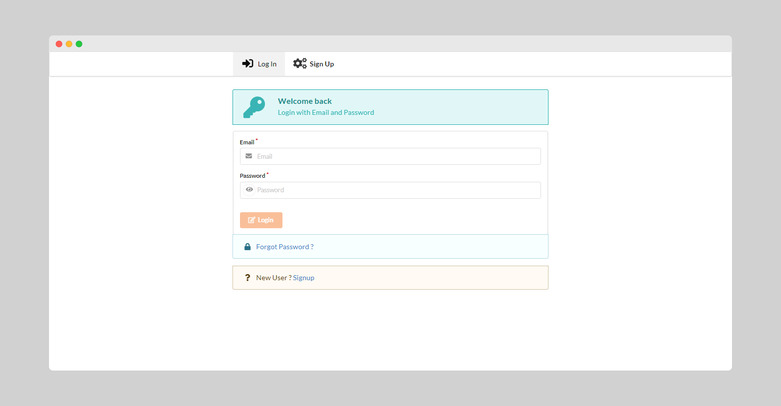
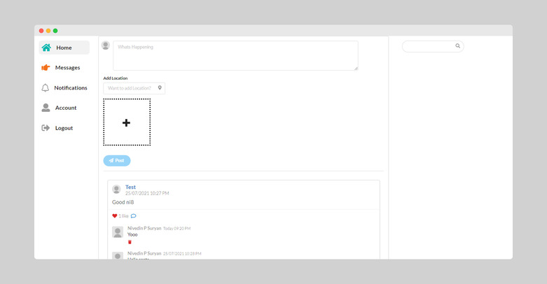
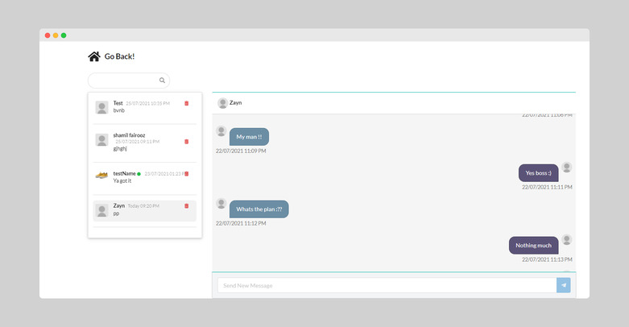
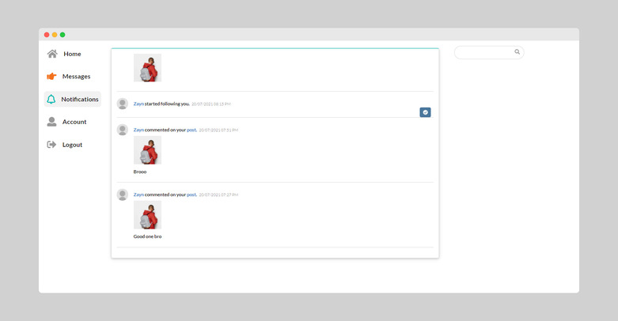
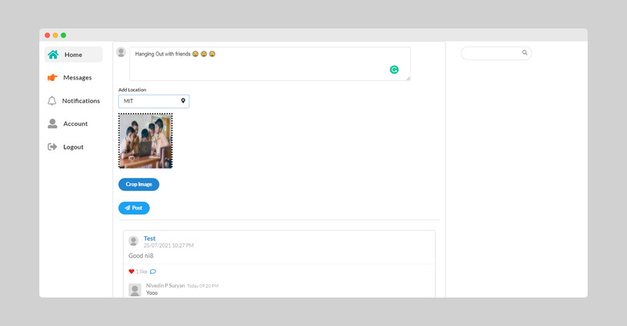
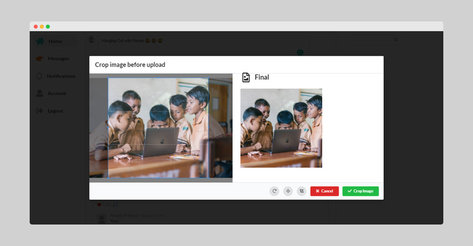

<!-- PROJECT LOGO -->
<br />
<p align="center">
  <a href="https://social-media-nextjs.herokuapp.com/">
    
  </a>

  <h3 align="center">NextBook </h3>

  <p align="center">
    - A nextjs Social Media built with ❤️
    <br />
    <br />
    <a href="https://social-media-nextjs.herokuapp.com/">View Demo</a>
  </p>
</p>

<!-- TABLE OF CONTENTS -->
<details open="open">
  <summary>Table of Contents</summary>
  <ol>
    <li>
      <a href="#about-the-project">About The Project</a>
      <ul>
        <li><a href="#built-with">Built With</a></li>
      </ul>
    </li>
    <li>
      <a href="#getting-started">Getting Started</a>
      <ul>
        <li><a href="#prerequisites">Prerequisites</a></li>
        <li><a href="#installation">Installation</a></li>
      </ul>
    </li>
    <li><a href="#usage">Usage</a></li>
    <li><a href="#contact">Contact</a></li>
  </ol>
</details>

<!-- ABOUT THE PROJECT -->

## About The Project








NextBook is a minimalistic social network built using Nextjs and MERN stack. It’s super fast with real-time notification and chats - the reason for its speed is that it's built using functional programming (FP) concepts like immutability.

### Built With

- NextJs
- NodeJs
- Express
- MongoDb
- Mongoose
- Socket.io
- Tailwind CSS

<!-- GETTING STARTED -->

## Getting Started

This is an example of how you may give instructions on setting up your project locally.
To get a local copy up and running follow these simple example steps.

### Prerequisites

This is an example of how to list things you need to use the software and how to install them.

- npm
  ```sh
  npm install npm@latest -g
  ```

### Installation

1. Get a free API Key at [https://example.com](https://example.com)
2. Clone the repo
   ```sh
   git clone https://github.com/your_username_/Project-Name.git
   ```
3. Install NPM packages
   ```sh
   npm install
   ```
4. Enter your API in `config.env`
   ```JS
   const API_KEY = 'ENTER YOUR API';
   ```

<!-- USAGE EXAMPLES -->

## Usage

Run the code

```sh
npm start
```

Test Login Credentials

Email - nivedinpp@gmail.com
Password - qwe123

<!-- CONTACT -->

## Contact

Nivedin - [nivedinp](https://twitter.com/nivedinp) - nivedinp@gmail.com
